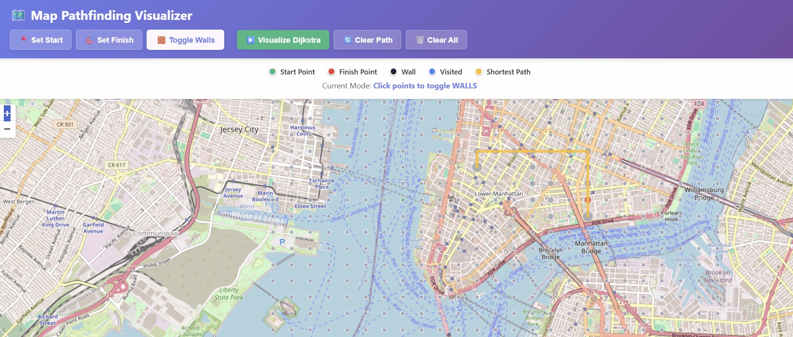

# 🗺️ Map Pathfinding Visualizer 

React-based pathfinding visualizer that runs Dijkstra's algorithm on real-world maps using OpenStreetMap.

## Pathfinding Visualizer Demo




## 🚀 Quick Start

```bash
npm install
npm start
```

Open http://localhost:3000 - You should immediately see:
- A map with a grid of small gray dots
- Green dot (start) and red dot (finish) already placed
- Buttons that work when clicked

## 📖 Step-by-Step Usage

### 1. Set Start Point (Green)
- Click **"📍 Set Start"** button
- Click anywhere on the map
- Green dot moves to that location

### 2. Set Finish Point (Red)  
- Click **"🎯 Set Finish"** button
- Click anywhere on the map
- Red dot moves to that location

### 3. Add Walls (Optional)
- Click **"🧱 Toggle Walls"** button (default mode)
- Click any gray dots to make them black walls
- Click black walls to remove them

### 4. Run the Algorithm
- Click **"▶️ Visualize Dijkstra"**
- Watch blue dots spread from start to finish
- Yellow line shows the shortest path found

### 5. Reset
- **"🔄 Clear Path"** - Removes blue/yellow but keeps walls
- **"🗑️ Clear All"** - Complete reset

## 🎨 Visual Guide

| Color | Meaning | Size |
|-------|---------|------|
| 🟢 Green | Start Point | Large (10px) |
| 🔴 Red | Finish Point | Large (10px) |
| ⚫ Black | Wall/Obstacle | Medium (6px) |
| 🔵 Blue | Visited (searching) | Small (4px) |
| 🟡 Yellow | Shortest Path | Medium (7px) |
| ⚪ Gray | Unvisited Point | Tiny (4px) |

## 🏗️ How It Works

### Grid System
```javascript
// Creates 25x25 grid of nodes
const grid = createMapGrid(center, 25);
// Each node has: lat, lng, row, col, distance, isWall, etc.
```

### Click Detection
```javascript
// Finds closest node to your click
const clickedNode = findClosestNode(latlng);
```

### Dijkstra's Algorithm
```javascript
1. Start with distance 0
2. Visit closest unvisited node
3. Check all 4 neighbors (up, down, left, right)
4. Update distances if shorter path found
5. Repeat until target found
```

### Animation
```javascript
// Shows each visited node one at a time
setTimeout(() => {
  this.setState({ visitedNodes: newVisited });
}, 30 * i); // 30ms delay per node
```

## 🔧 Customization

### Change Map Location
Edit in `MapPathfindingVisualizer.jsx`:
```javascript
const DEFAULT_CENTER = [40.7128, -74.0060]; // NYC
const DEFAULT_ZOOM = 14;
```


## 📦 Project Structure

```
src/
├── algorithms/
│   └── dijkstra.js          ← Core algorithm logic
├── PathfindingVisualizer/
│   ├── MapPathfindingVisualizer.jsx  ← Main component
│   └── MapPathfindingVisualizer.css  ← Styling
├── App.js                   ← Root component
└── index.js                 ← Entry point
```

## 🔬 Algorithm Details

### Time Complexity
- **O((V + E) log V)** where V = nodes, E = edges
- For 25x25 grid: ~625 nodes, ~2400 edges
- Runs in milliseconds

### Space Complexity
- **O(V)** for storing distances and visited states

### Why Dijkstra?
- ✅ Guarantees shortest path
- ✅ Works with weighted edges
- ✅ Easy to visualize
- ✅ Foundation for A*, etc.


## 🙏 Credits

- OpenStreetMap contributors
- Leaflet.js team  
- React-Leaflet maintainers
- Dijkstra (for the algorithm!)


